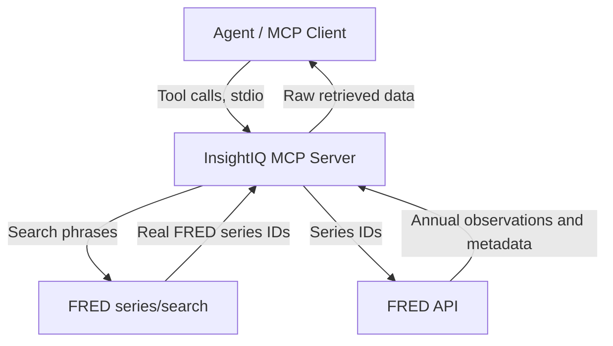

# InsightIQ: Economy Insight Assistant

InsightIQ is a local [MCP](https://modelcontextprotocol.io) server that gives
an AI agent (Claude Code, Claude Desktop, or any other MCP client) the ability
to look up real FRED (Federal Reserve Economic Data) series and their
historical observations to answer economic questions.

The flow is:

1. An agent searches FRED's live series catalog (via the `search_economic_series`
   or `get_economic_data` tool) for series relevant to the user's question.
2. The agent fetches annual observations and units for the series it cares about.
3. The agent analyzes that data itself and answers the user's question —
   InsightIQ returns retrieved data only, it does not generate the explanation.

## Install

Published on npm as [`insightiq-mcp`](https://www.npmjs.com/package/insightiq-mcp).
You'll need a free FRED API key first: [get one here](https://fred.stlouisfed.org/docs/api/api_key.html).

```json
{
  "mcpServers": {
    "insightiq": {
      "command": "npx",
      "args": ["-y", "insightiq-mcp"],
      "env": {
        "FRED_API_KEY": "your_fred_api_key_here"
      }
    }
  }
}
```

Add that to your MCP client's config (a `.mcp.json` file for Claude Code, or
Settings → Developer → Edit Config in Claude Desktop). See
[`mcp/README.md`](mcp/README.md) for the full tool reference and per-client
details.

## Architecture



Everything runs as a single local process launched by the agent host. There
is no database, no local catalog, no separate backend service, and no LLM call
anywhere in InsightIQ itself — the only model doing any reasoning about the
data is whichever LLM is driving the calling agent.

## Tools

### `search_economic_series`

Searches FRED's live series catalog. Takes `queries`: 1-3 concise, FRED-style
keyword phrases (e.g. `["inflation", "consumer price index"]`) rather than a
full question — FRED's full-text search effectively requires every word in a
phrase to match, so short specific phrases work far better than sentences.
Returns real FRED series IDs and titles only; it never invents series IDs.
Each phrase is run through a filler-word stripper before hitting FRED for
exactly this reason. Optional `limit` (default 4) and `tags`/`excludeTags`
(FRED's tag vocabulary, e.g. geography or seasonal adjustment) narrow results
further.

### `get_series_observations`

Fetches historical annual observations and units for specific FRED series IDs.
Returns raw data only — no summary or explanation is generated.

### `get_economic_data`

Convenience tool that chains the two above: searches for relevant series using
`searchQueries` if given (falling back to the raw `question` otherwise), then
fetches their observations. Still returns raw data only. Accepts the same
`limit`/`tags`/`excludeTags` as `search_economic_series`.

### `list_series_tags`

Given a topic phrase, returns the FRED tags that actually exist among
matching series with their series counts — the discovery step for using
`tags`/`excludeTags` above, since FRED's tag vocabulary usually can't be
guessed reliably.

---

## Development

The following is only relevant if you want to modify this server or
contribute to it — not needed to use it (see **Install** above for that).

- `mcp/`: the MCP server. `src/tools/` are the exposed tools; `src/services/`
  and `src/clients/` hold the FRED search and data-fetch logic; `evals/`
  has the MCP-level eval suite (tool contract + retrieval recall).

Prerequisites: Node.js 20 or newer, a FRED API key.

```bash
git clone https://github.com/ravi-p-k-1/InsightIQ.git
cd InsightIQ/mcp
npm install
```

Create `mcp/.env` from `mcp/.env.template`:

```bash
FRED_API_KEY=your_fred_api_key_here
```

Run it directly to confirm it starts:

```bash
npm start
```

The repository root has a project-scoped `.mcp.json` that points Claude Code
at your local checkout (picked up automatically when opened at the repository
root, with your approval on first use) — useful for testing changes before
publishing a new version.

### Validation

GitHub Actions runs CI on pushes to `main` and on pull requests: installs
dependencies and checks syntax, without calling FRED.

```bash
cd mcp
find src evals -name "*.js" -print0 | xargs -0 -n1 node --check
```

There is no separate unit-test suite — correctness and quality are verified
through MCP-level evals that connect a real client to the real server
in-process and drive it exactly the way an agent would. These call the live
FRED API, so they're run manually rather than in CI:

```bash
cd mcp
npm run eval:contract          # tool inventory, schema/error-path, happy-path checks
npm run eval:retrieval         # retrieval recall floor (single raw question)
npm run eval:retrieval:smart   # retrieval recall ceiling (curated query plans)
```

`eval:retrieval` measures the no-query-intelligence floor (45.3% on the
current question set); `eval:retrieval:smart` replays a checked-in set of
per-question search phrases/tags chosen the way a competent agent would
(62.4%), without needing a live LLM call at eval time. See
[`mcp/README.md`](mcp/README.md) for what each eval checks.
